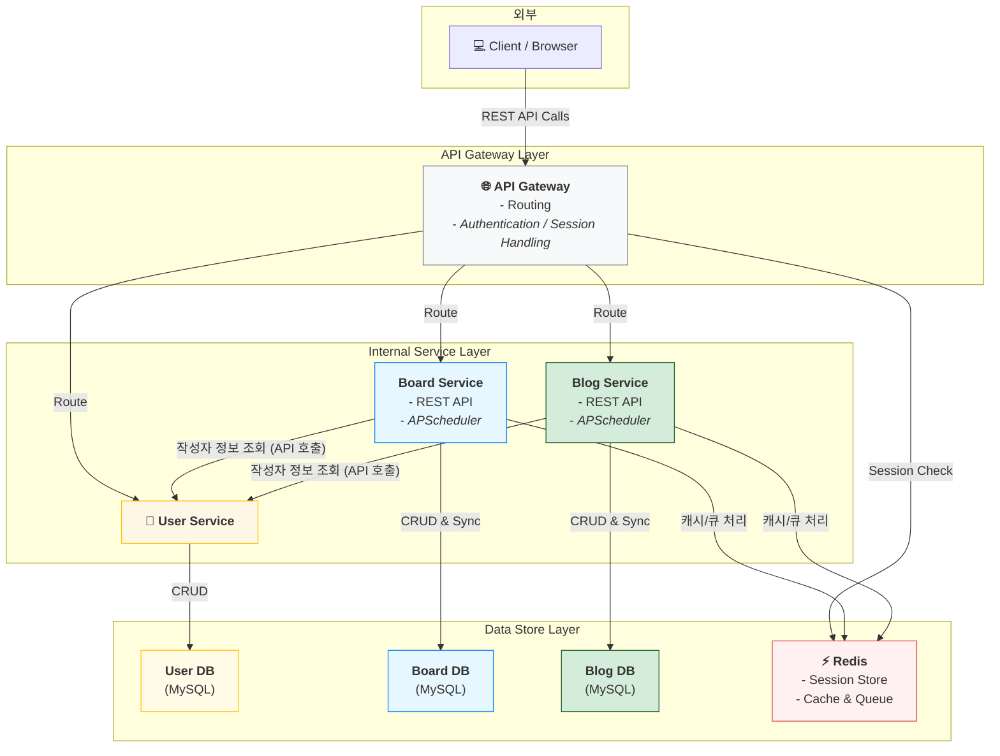

```mermaid
graph TD
   subgraph "외부"
       Client[💻 Client / Browser]
   end

   subgraph "API Gateway Layer"
       style Gateway fill:#f8f9fa,stroke:#6c757d
       Gateway["<b>🌐 API Gateway</b><br/>- Routing<br/>- <i>Authentication / Session Handling</i>"]
   end

   subgraph "Internal Service Layer"
       style BoardService fill:#e6f7ff,stroke:#007bff
       style BlogService fill:#d4edda,stroke:#155724
       style UserService fill:#fff7e6,stroke:#ffc107
       BoardService["<b>Board Service</b><br/>- REST API<br/>- <i>APScheduler</i>"]
       BlogService["<b>Blog Service</b><br/>- REST API<br/>- <i>APScheduler</i>"]
       UserService["<b>👤 User Service</b>"]
   end

   subgraph "Data Store Layer"
       style UserDB fill:#fffbe6,stroke:#ffc107
       style BoardDB fill:#e6f7ff,stroke:#007bff
       style BlogDB fill:#d4edda,stroke:#155724
       style Redis fill:#fff0f1,stroke:#dc3545
       UserDB["<b>User DB</b><br/>(MySQL)"]
       BoardDB["<b>Board DB</b><br/>(MySQL)"]
       BlogDB["<b>Blog DB</b><br/>(MySQL)"]
       Redis["<b>⚡ Redis</b><br/>- Session Store<br/>- Cache & Queue"]
   end

   Client -- "REST API Calls" --> Gateway

   Gateway -- "Session Check" --> Redis
   Gateway -- "Route" --> BoardService
   Gateway -- "Route" --> BlogService
   Gateway -- "Route" --> UserService
   
   UserService -- CRUD --> UserDB
   BoardService -- "작성자 정보 조회 (API 호출)" --> UserService
   BlogService -- "작성자 정보 조회 (API 호출)" --> UserService

   BoardService -- "CRUD & Sync" --> BoardDB
   BlogService -- "CRUD & Sync" --> BlogDB

   BoardService -- "캐시/큐 처리" --> Redis
   BlogService -- "캐시/큐 처리" --> Redis
```
